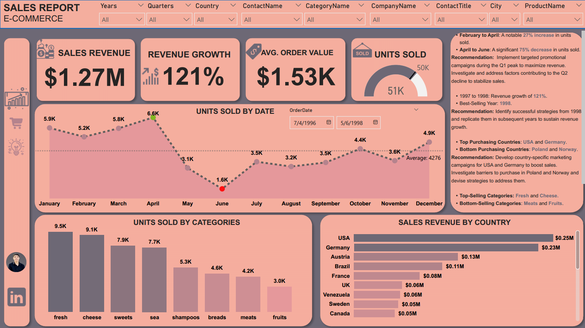
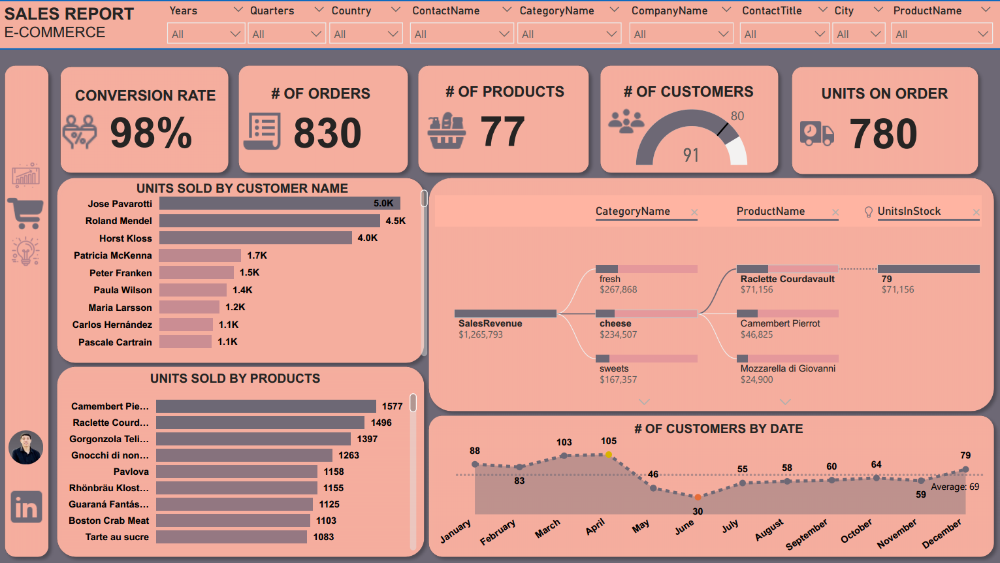
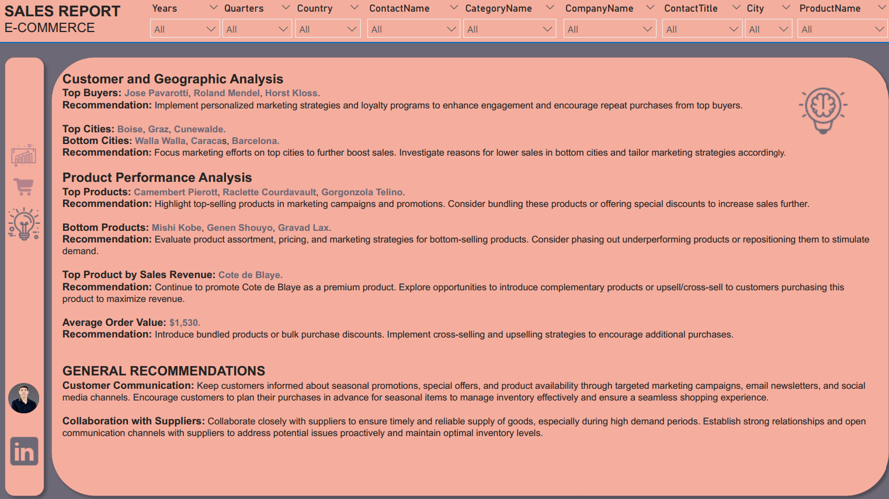

> **Power BI portfolio project** that converts historical sales data into clear, action‑oriented stories at the global, regional, and product levels.
> Designed with deep **DAX measures**, clean **Power Query** transformations, and engaging visuals to guide strategic decisions.

---

## 🚀 Why This Project Matters

| Business Question                                                      | Dashboard Answer                                                       |
| ---------------------------------------------------------------------- | ---------------------------------------------------------------------- |
| How did sales trend quarter‑over‑quarter and year‑over‑year?           | Clear KPIs & variance cards (YoY + QoQ), spark lines on the dashboard. |
| Which markets and products drive (or drain) revenue and profit?        | Dynamic ranking visuals with conditional formatting.                   |
| Where should we focus marketing & inventory budgets next quarter?      | Integrated insights translate into prioritized actions.                |
| How can we raise average order value and reduce under‑performing SKUs? | Basket analysis & AOV metrics with targeted upsell suggestions.        |

---

## ✨ Visual Preview

| Sales Overview | Product Performance | Market Insights |
|  |  |  |

---

---

## 🛠️ Tools & Skills Demonstrated

* ✅ **Power Query** for data import, cleansing, column derivation, and date table creation
* ✅ **Power BI Data Model**: star schema, relationships, hidden keys
* ✅ **DAX Measures** for Revenue growth, RankX‑based top‑N lists, Conversion rate
* ✅ **Conditional Formatting & Slicers** for interactive storytelling
* ✅ **Drill‑through** to customer and product detail views

---

## 📊 Dashboard Highlights

* **Sales Performance**

  • 27 % unit‑sales growth from February → April (Q1 momentum)

  • 75 % unit drop from April → June (Q2 slump alarm)

  • Year‑over‑Year revenue up **121 %** (1997→1998)

* **Product Analysis**

  • Top categories: **Fresh** & **Cheese** (lead 42 % of revenue)&#x20;

  • Bottom categories: **Meats** & **Fruits**

  • Star products: *Camembert Pierrot*, *Raclette Courdavault*, *Gorgonzola Telino*

  • Under‑performers: *Mishi Kobe*, *Genen Shouyu*, *Gravad Lax*

* **Geographic & Customer Insights**

  • Country & city heat‑maps with tailored tactics

  • Customer‑level 360° view (buy frequency, spend, upsell potential)

  • Action list ranked by ROI & ease‑of‑implementation

---

## 📌 Key Insights & Recommendations

| #  | Insight                                                    | Specific Recommendation                                                                                           |
| -- | ---------------------------------------------------------- | ----------------------------------------------------------------------------------------------------------------- |
| 1  | **Q1 surge:** Units +27 % Feb→Apr                          | Launch limited‑time bundles in late Q1 to sustain momentum; secure extra inventory by mid‑February.               |
| 2  | **Q2 crash:** Units −75 % Apr→Jun                          | Conduct root‑cause analysis (seasonality vs stock‑outs); run flash promotions and email retargeting by early May. |
| 3  | **Revenue +121 % YoY** (1997→1998)                         | Replicate 1998 marketing mix (channel spend & discount cadence) across Q3 of current year.                        |
| 4  | **Top markets:** USA & Germany                             | Localise campaign creatives; double PPC budget in DE, expand U.S. subscription offers.                            |
| 5  | **Low markets:** Poland & Norway                           | Introduce localized pricing tiers; partner with local distributors for faster delivery.                           |
| 6  | **Top categories:** Fresh & Cheese                         | Feature these in homepage banners; develop recipe content to boost cross‑sell.                                    |
| 7  | **Weak categories:** Meats & Fruits                        | Review shelf‑life and pricing; test bundle discounts with top categories.                                         |
| 8  | **VIP buyers:** Jose Pavarotti, Roland Mendel, Horst Kloss | Offer exclusive previews, loyalty tiers, and referral bonuses.                                                    |
| 9  | **Top cities:** Boise, Graz, Cunewalde                     | Ensure stock availability; geo‑target ads within 50‑km radius of these cities.                                    |
| 10 | **High AOV = \$1,530**                                     | Upsell with accessory bundles; implement cart recommendations based on past purchases.                            |
| 11 | **Premium leader:** Côte de Blaye                          | Promote premium gifting bundles; create vertical tastings to raise repeat purchases.                              |

---

## 🧠 What This Project Shows About Me

* ✅ Ability to dissect sales data into **actionable market strategies**
* ✅ Expertise in **Power BI modelling, DAX, and UX design**
* ✅ Skill at turning insights into **clear, prioritized recommendations**
* ✅ Focus on **data‑driven storytelling** that resonates with executives

---

## 👤 About Me

**Eslam Ashraf** — Data Analyst who translates numbers into growth strategies. Specialised in Power BI, Excel, SQL, and advanced analytics.

📧 [Email](mailto:islamashraf.b@gmail.com) • 👤 [LinkedIn](https://www.linkedin.com/in/eslamashraff/)

> *“Analytics only matters when it drives better decisions.”*

---

### ⭐ If this project inspired you, **star the repo** and help spread data‑driven thinking!
